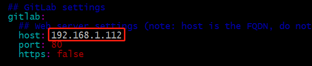

# gitlab 8.0 轻量级部署

## 1. gitlab docker下的部署


### 1.1 拉取老版本的gitlab的镜像到本地

```shell
docker pull gitlab/gitlab-ce:8.0.0-ce.0
```


### 1.2 创建docker-compose部署文件

```yaml
version: "3"

services:
  gitlab:
    restart: always
    image: gitlab/gitlab-ce:8.0.0-ce.0
    container_name: gitlab.lab.io
    hostname: gitlab.lab.io
    ports:
      - "80:80"
      - "22:22"
    volumes:
      - ./config:/etc/gitlab
      - ./logs:/var/log/gitlab
      - ./data:/var/opt/gitlab
```

*<u>**需要提前创建主机的目录**</u>*


### 1.3 启动docker容器

```shell
docker-compose -f docker-compose.yaml up -d 
```

<!--启动前需要确保宿主机目录已经存在了-->

------

## 2. GitLab 进行汉化

### 2.1 克隆 Gitlab代码仓库

```sh
git clone https://gitlab.com/larryli/gitlab.git
```


### 2.2 构建代码差异补丁

```shell l
git diff origin/8-0-stable..origin/8-0-zh > patch.diff
```


### 2.3 然后将汉化包复制到仓库容器内部

```sh
docker cp patch.diff gitlab.lab.io:/tmp
```


### 2.4 应用补丁，并重启服务

```sh
docker exec -it gitlab.lab.io bash -c "patch -d /opt/gitlab/embedded/service/gitlab-rails -p1 < /tmp/patch.diff ; gitlab-ctl restart;"
```


## 3. Gitlab配置克隆地址链接

### 3.1 进入到Gitlab容器内部

```sh
docker exec -it gitlab bash
```

> 根据实际情况修改容器名称或者使用容器ID均可


### 3.2 编辑配置文件

```sh
vim /opt/gitlab/embedded/service/gitlab-rails/config/gitlab.yml
```



> 修改host值和port值即可

### 3.3 重启服务是配置生效


```shell
gitlab-ctl restart 
```

